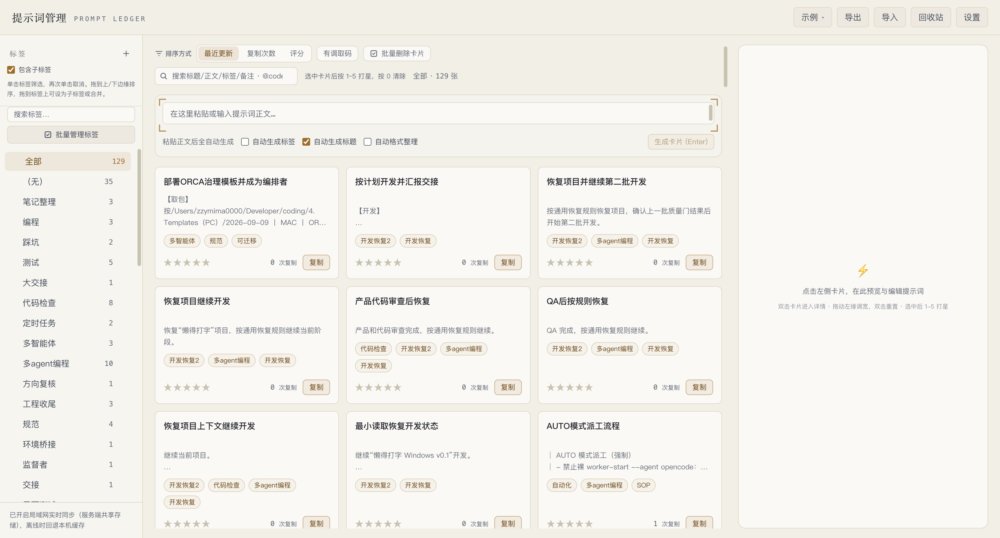

# Prompt Manager（提示词管理工具）

[简体中文](./README.md) | English

> A local web app that turns your prompt library into a searchable knowledge base plus an agent interface: paste a prompt, get a titled and tagged card, copy it to keep count, store everything in a local SQLite database, and let AI agents such as WorkBuddy inject any card as a system prompt through a short recall code over MCP (Model Context Protocol — the standard that lets an agent call external tools).




> Screenshots taken from the live app on 2026-10-05 (main view + card detail editing panel), showing real local data.

## Why this exists

- **Prompts are scattered everywhere**: chat history, notes apps, Notion, local `.txt` files. When you want to reuse one, you cannot find it, and copy-paste introduces errors.
- **Switching AI roles is tedious**: every time you want an agent to act as a code reviewer, translator, or prompt optimizer, you paste a long system prompt again.
- **Devices do not stay in sync**: prompts organized on computer A are invisible on computer B.
- **No usage data**: you cannot tell which prompt you use most, or which one works best.

This tool covers all of that in one flow: paste the body → AI extracts a title and tags → one-click copy (with a counter) → real-time sync across devices on your LAN → assign a recall code to a card → say "recall <code>" in WorkBuddy and it starts working in that role.

## Highlights

- **AI organizes the card**: pasting a body generates its title and tags, so there is nothing to maintain by hand.
- **Copy counts immediately**: manual copies and MCP recalls share one counter, so the most-used prompts are visible.
- **Recall code activates a role**: give a card a short code, and "recall <code>" in an agent injects its body as the new system prompt.
- **Global search**: the SortBar search box (300 ms debounce) matches title, body, tags, recall code, and notes case-insensitively; `@code` jumps straight to one card (recall code only); `<mark>` highlighting stays legible in both themes (driven by the `--color-highlight` variable — amber at 42% with a ring in dark, highlighter on paper in light, WCAG AA); a hit counter and an empty-state hint are included; the term clears on refresh.
- **Delete straight from the grid**: hovering a card reveals a red delete button under "edit"; whether it asks for confirmation is a setting; deleting clears the current selection and detail view; the read-only demo view hides it.
- **Two themes**: follow the system, dark, or light (chosen in settings). An inline first-paint script presets the theme so nothing flashes, and the system mode tracks your OS preference live; CSS variables drive the whole site and the highlighting.
- **Real-time LAN sync**: several computers share one dataset, and create/update/delete changes are pushed to each other within seconds.
- **Save on blur**: leaving any edited field commits it (the way Tencent Docs and Feishu work), so you never click save. The body **only creates a version snapshot on explicit save or `Ctrl/Cmd+Enter`**; blur saves the body without a snapshot, so "I forgot to press save" stops happening.
- **Versions are traceable**: every body save archives automatically (up to 10 versions) and can be rolled back.

## Quick start

### Prerequisites

- **Node.js** ≥ 24 (24+ recommended, for the built-in `node:sqlite`)
- **An AI API key** — pick one of three providers: DeepSeek official, OpenRouter, or OpenCode (Zen free tier or Go paid tier). The current default is `opencode-go`: https://opencode.ai/zen/go/v1
- **A Supabase account** (optional, for multi-device sync; leave it unset and you get a pure local single-machine mode)

### Installation and run

```bash
# 1. Install dependencies
npm install

# 2. Configure the key
cp .env.local.example .env.local
#   Edit .env.local and set AI_API_KEY=sk-xxx (or an AI_PROVIDER/AI_MODEL/AI_BASE_URL combination)
#   For multi-device sync, optionally fill NEXT_PUBLIC_SUPABASE_URL / NEXT_PUBLIC_SUPABASE_PUBLISHABLE_KEY (empty = local single machine)

# 3. Start the development server
npm run dev
#   Open http://192.168.31.60:3100 and sign in to the cloud (do not use localhost:3100 — the redirect allowlist blocks it)

# (Optional) start it under a self-healing watchdog; a crashed service restarts after 3 seconds:
./dev-server.sh start        # start (refuses if 3100 is already taken by Docker)
./dev-server.sh status       # show status
./dev-server.sh logs         # show logs
./dev-server.sh stop         # stop
```

> Local SQLite is the only primary store (`data/prompt-manager.db`, WAL mode). If Supabase is configured, devices sync; otherwise it stays local and single-machine.

### Production deployment (Docker / Mac Mini)

The intended production model is: **one Docker container on the Mac Mini, and every other machine only opens it in a browser**. A PC does not need Node, a clone of the project, or `npm run dev`.

```text
PC / other Mac browser
        ↓  http://192.168.31.60:3100 (the verified address; not localhost, not .local)
Mac Mini Docker: Prompt Manager web service (single container on 0.0.0.0:3100)
        ↓  SQLite (/app/data/prompt-manager.db, bind-mounted to DockerData)
DockerData/prompt-manager/legacy-store (host disk persistence)
```

The Docker configuration files are `Dockerfile`, `compose.yaml`, and `.dockerignore` in the project root. They are deployment templates, **not** authorization to run the production service from the development directory: production code must first reach the deployment source area through the Git flow:

```text
/Users/zzymima0000/Services/prompt-manager/
```

In that deployment directory, copy the project's `docker/env.template` to a `.env.local` that is never committed to Git, fill in the placeholders, and at least confirm:

```bash
cp docker/env.template .env.local
```

```dotenv
NEXT_PUBLIC_APP_URL=http://Mac-mini.local:3100
PROMPT_MANAGER_DATA_DIR=/Users/zzymima0000/DockerData/prompt-manager/legacy-store
PROMPT_MANAGER_PORT=3100
```

`NEXT_PUBLIC_SUPABASE_URL` and `NEXT_PUBLIC_SUPABASE_PUBLISHABLE_KEY` are optional (empty = local single-machine mode); they are public browser configuration. `DEEPSEEK_API_KEY`, MCP tokens, and every other secret stay only in `.env.local` and must never appear in the Dockerfile, the compose file, or Git.

After creating the persistence directory above, run from `Services/prompt-manager`:

```bash
docker compose --env-file .env.local up -d --build
docker compose ps
```

The address is fixed at `http://Mac-mini.local:3100`. Use it inside the LAN only; do not set up port forwarding on the router. To let other devices sign in, add that exact address to Supabase Auth's **Site URL** and Redirect URLs, and add it to Google Cloud's Authorized JavaScript origin — but Google's Authorized redirect URI must remain the `/auth/v1/callback` that Supabase shows, not port 3100.

> Docker does not run a Supabase database and does not create a database volume. SQLite is the only primary data source (`/app/data/prompt-manager.db`, bind-mounted to the `DockerData/prompt-manager/legacy-store` host path). Back up with `bash scripts/backup-sqlite.sh backup`; products go to `/Users/zzymima0000/DockerBackups/prompt-manager/` and must not be committed to Git.

> The port is **3100** everywhere (`package.json` dev/start and the `PORT` in `dev-server.sh`). MCP reads cards through the local HTTP API (`/api/mcp/activate`) instead of connecting to Supabase directly.

## Feature overview

| Feature | Description |
|---|---|
| AI-generated metadata | Paste a prompt body and DeepSeek generates the title and tags automatically (both editable). When the AI cannot judge the domain, tags stay empty (`DISCARD_TAGS` filters "uncategorizable / uncategorized / other / none / no tags", the prompt forbids placeholder tags, and existing dirty tags are cleaned up in tag management) |
| Demo knowledge base | 12 built-in sample cards (with their own recall codes) that cover every feature shape, loaded into your local store in one click |
| Copy counter | The card's copy button writes to the clipboard and increments the count; **MCP recalls increment it too**; the count can be reset |
| Recall code (`code`) | A user-defined short code (letters, digits, hyphens, ≤12 characters, case-insensitive, optional) used by MCP to fetch the card. While typing, the title shows `x/20` and the code shows `x/12`; invalid characters are filtered immediately with the hint "letters / digits / hyphens only" |
| MCP integration | Sub-package `mcp/prompt-server/`, tool `prompt_manager_activate_prompt(code)`: uses a separate revocable token to fetch a card from the local HTTP API and immediately inject its body as the new system prompt for the session |
| Global search | SortBar search box (300 ms debounce, filtering entirely in the browser) over title, body, tags, recall code, and notes (case-insensitive), plus `@code` direct access (recall code only), plus `<mark>` plain-text highlighting (immune to XSS), plus a "hits x / total y" counter, plus an empty-state hint. **While a search is active, results sort by relevance (title 4 > recall code / tag 3 > notes 2 > body 1, ties then broken by update / copy count / rating; `@code` isolation keeps the original order)**. The term is not persisted and clears on refresh |
| Star rating | Click `1`–`5` to rate, `0` to clear |
| Tag filter | The left tag panel filters on a single selection (click again to clear), ordered by count. While a filter is active, a new card inherits the selected tag (forced first, then AI tags deduplicated as extras, 3 tags maximum; "all" and the demo view do not force it) |
| Tag system (decoupled by ID) | `tags` 11 + `promptTags` 55 (多age×3 / 多aengt×1 merged into 多agent编程, "无法分类" removed, 0 orphans), with `Tag` / `PromptTag` decoupled by ID. `src/lib/tags.ts` holds pure functions for the 11/55 migration (guards + tree building + cycle/duplicate-name detection + 8 mutations + `syncCardsToPromptTags`). `TagPanel` provides the tree, expansion memory, full-path search, an "untagged" bucket, and a `⋯` menu for rename / move / delete (cascading in both modes without deleting prompts, with confirmation). New cards inherit the current tag, the 3-tag limit is preserved, and the `cards.ts:50字` root cause is fixed. `scripts/migrate-tags.mjs` runs the migration in one command |
| Tag chip dual write | Removing a tag with the chip `×` calls `handleUpdateMeta`, which writes both `card.tags` and `promptTags` (`resolveTagIds → setCardTags → syncCardsToPromptTags`). Rename rollback is fixed (the macrotask `schedulePush` merge prevents an SSE echo rollback), and new tags validate that `parentId` exists; `BUG-NEW-1 CLOSED`. Cards, preview, and detail all show the full path `parent/child` (`promptTagPathsOf`), which separates same-name tags under different parents and falls back to the plain name when there is no relation |
| Tag management | Hovering a tag row shows `×` (also reachable by keyboard focus-visible). Clicking asks for confirmation — "the tag will be removed from N cards… the cards themselves are not deleted" — then removes that entry from every card holding it (the body text is untouched); the count disappears when it reaches 0; the `×` is hidden in the demo view |
| Add-tag interaction (P0-9) | The tag area of the detail / preview panel is rebuilt as a flomo-style `TagEditor`: type `#tagname` and press **Enter or Space** to add it as a chip (comma and ideographic-comma separators are no longer accepted); one tag per action, so entries cannot interfere with each other. An autocomplete dropdown of existing tags appears while typing (click or Enter adds it); `×` on a chip removes that one; the limit (3 by default) shows a red hint; blur commits a half-typed tag as a fallback; and it stays bidirectionally compatible with the `tagsText` editing path in `handleUpdateMeta` (`parseTags` / `join('、')`) |
| Delete straight from the grid | On card hover, a floating capsule `absolute top-2 right-2 bg-ink-900/80 backdrop-blur` (shown by `group-hover` / `focus-within` / `bulkActive`) holds multi-select, edit, and delete. The `text-rust` delete respects `Settings.confirmDelete` before calling `window.confirm` — "Delete "{title}"? You can restore it from the trash." The title keeps `pr-16` so the code badge is never covered, and `line-clamp-3` reclaims the body whitespace; hidden in demo; the switch in settings saves on click (2026-08-28, 12 items PASS) |
| Trash | "Trash (n)" in the top bar: deleting cards (single or batch) and deleting tags go there first (a local `pm:trash` snapshot, up to 100 entries). Entries can be restored (idempotent, backfills missing ids, and the restore path re-syncs normally); only an explicit "empty" deletes for good. It coexists with the 10-second undo stack (2026-09-16 device QA PASS) |
| Sorting | Descending by update time / copy count / rating. When a search is active, relevance (title 4 / recall code·tag 3 / notes 2 / body 1) goes first, with the same secondary tie-break |
| Format normalization | `normalizeBody` runs on save: strip leading tabs line by line, normalize whitespace-only lines, keep at most 4 leading spaces on non-empty lines, drop leading and trailing blank lines, and collapse runs of blank lines (`\\n{3,}` → `\\n\\n`). The import paths (JSON / Markdown) normalize the same way, so the whole document stays left-aligned |
| Duplicate check | Before a new card is submitted, `normalizeBody` values are compared for exact equality; a match opens `confirm` — "this content already exists (title "X"). Add it anyway?" — canceling adds nothing, confirming continues. Empty or different content does not prompt, and the first match prompts only once |
| Search highlighting | Driven by the `--color-highlight` / `--color-highlight-text` / `--color-highlight-ring` / `--color-highlight-shadow` variables: dark `#fbbf24/#111111`, 11.3:1 solid black text with an outer glow; light `color-mix 50% #fcd34d/#451a03`, 12.5:1 translucent deep brown with a strong outline (root cause fixed: `text-highlight` → `--color-highlight-text` was obscuring it). `rounded-[3px] px-[1px] shadow` adapts to both themes |
| Theme switch | `Settings.theme: 'dark'\|'light'\|'system'`, with `DEFAULT_SETTINGS` + `normalizeSettings` migration. An inline script in `layout.tsx` plus `suppressHydrationWarning` prevents a flash of unstyled content; the `theme` useEffect in `page.tsx` tracks the system; the select in settings saves on change |
| Rating guard | While the detail or settings dialog is open, `if (detailId \|\| showSettings) return` blocks the global `1-5` rating shortcuts so you cannot accidentally rate a background card |
| Empty / offline banner | `serverOnline` has three states (null connecting / false offline with a rust banner and retry / true online), kept distinct from the "store is empty" message so both remain recoverable |
| Composer auto-height | Pasting a long body grows the `autoResize` input up to `maxRows=6` (`resize-none`), so you never drag it |
| Import detail | `SkippedCard` + `describeCardFailure` give field-level reasons; `parseMarkdownImport` puts an empty body into `skipped`, `parseImport` supports partial JSON import; the `Toast` detail is a scrollable list shown for 6 s |
| Version throttling | Blur saves without creating a version (`saveBodyOnly` with exact-equality comparison); only explicit save / `Ctrl+Enter` calls `saveBodyWithVersion`. Throttled merges stop snapshots filling the quota |
| Undo stack | Four kinds of dangerous operations (delete, empty, …) offer `notifyWithUndo` + `undoRef` for 10 s, with detail shown in the `Toast` |
| Batch management | A `bulkIds` Set + a checkbox per card (`role="checkbox"`) + a top action bar (tag / rate / export / delete / deselect) + a 10 s undo stack (2026-08-28, 12 items PASS, API count 33 → 32) |
| Mobile drawer | Below `md`, the preview panel becomes a bottom `fixed` drawer (`max-h-[75dvh]` + `onClose` to collapse); at `md` and up it returns to the sidebar |
| Notes are not lost | `notesTimer` debounces 700 ms, and the useEffect cleanup plus card switching call `commitSave` to flush, so characters are never dropped or saved to the wrong card |
| Version diff | `VersionDiff` + `lineDiff` compute an LCS line-level diff, and expanding the version history highlights the comparison |
| Notes field | A 2-line resizable note above the body for your own "when to use / caveats" text. It is not AI-generated and saves on blur |
| Auto save | Title / tags / recall code / notes / rating save on blur; the body **saves and creates a version only on explicit save or `Ctrl/Cmd+Enter`**. An "auto-saved" badge appears after saving |
| Version rollback | Each body save generates a version automatically (up to 10 entries) with one-click rollback |
| Thinking-pattern summary | AI analyzes the prompt's framework and techniques, and caches the result on the card |
| Cross-device real-time sync | Server-side shared storage plus SSE (Server-Sent Events — the server pushes changes to open browser pages) pushes data bidirectionally between computers on the same LAN in real time |
| Import / export | Full backup and restore in JSON or Markdown (recall codes included). The import picker accepts `.json` + `.md` (`accept=".json,.md"`) and is reversible with the Markdown export; import results report `skipped` details (N imported / M skipped with field-level reasons) |
| Offline wording | The bottom of TagPanel matches the actual storage architecture: online — "LAN real-time sync is on (server-side shared storage); falls back to local cache when offline"; offline — "not connected to the sync service, using this machine's local data" |
| Closing never loses a draft | The detail dialog's Esc / backdrop / close button and the mobile drawer collapse all call `commitSave(true)` first to flush unsaved drafts (including the 700 ms debounced note), as does switching cards; neither path silently drops work |
| Delete impact count | Before deleting a tag, confirm shows "N prompts currently use this tag (or its children)" plus the child tag names separated by ideographic commas (`totalCount` deduplicated over the subtree); cards go 32 → 32 and prompts are never deleted |
| 10-second tag undo | Create / rename / move / delete on tags each offer "undo" inside the Toast for 10 s (`captureTagSnapshot` / `restoreTagSnapshot` with a three-state snapshot). On a device over vpn: delete then undo restored the tag, its relations, and the redundant `tags` completely |
| Server-side validation | `validateTagGraph` runs five checks (no duplicate name under the same parent / unique id / parent exists / acyclic / no dangling relation, and unique `(prompt_id, tag_id)`) and rejects in `serverStore.setState` before writing, while the client's `sanitizePromptTags` self-heals. Invalid data reports `数据校验失败` and is never persisted |
| Version-number commit | `knownVersion` / `baseVersion` give optimistic concurrency: a mismatch returns `conflict` and rejects, then reloads authoritative data, refreshes the view, and toasts "another device updated this… please retry", with SSE `lastPushedVersion` filtering out your own echo |

## Data storage

- **Local SQLite is the primary data source** (`data/prompt-manager.db`, WAL mode + foreign keys + `busy_timeout=5000`), migrated off Supabase on 2026-09-28 to reduce dependence on the network and a third party.
- Migrations are versioned (`db/migrations/`) and tables are created automatically on first start. Back up with `bash scripts/backup-sqlite.sh backup` (an online hot backup using VACUUM INTO) and restore with `bash scripts/backup-sqlite.sh restore <file>`.
- Optional multi-device sync: setting `NEXT_PUBLIC_SUPABASE_URL` + `NEXT_PUBLIC_SUPABASE_PUBLISHABLE_KEY` enables Supabase Realtime over 5 tables (cards / card_versions / tags / prompt_tags / settings); without it the app is purely local and single-machine.
- Authentication (optional): Supabase Auth (Magic Link + Google OAuth PKCE); the fixed access address is `http://192.168.31.60:3100`.
- Docker self-hosting: a single container on `0.0.0.0:3100`, with the SQLite database bind-mounted to `DockerData/prompt-manager/legacy-store` on the host disk. Backups all live in `/Users/zzymima0000/DockerBackups/prompt-manager/` and are not put in Git.

## MCP access (WorkBuddy / any MCP-capable agent)

1. In Prompt Manager open "settings → MCP local access" and generate a token for this computer; copy the one-time content and save it to `mcp/prompt-server/.env.local` (see `.env.example`).

2. Build the MCP server:

   ```bash
   cd mcp/prompt-server && npm install && npm run build
   ```

3. Register `prompt-manager` in `~/.workbuddy/mcp.json` (**no leading dot**; note that the dotted `.mcp.json` belongs to connector-proxy — do not confuse them):

   ```json
   {
     "mcpServers": {
       "prompt-manager": {
         "command": "node",
         "args": ["<project root>/mcp/prompt-server/dist/index.js"],
          "description": "本机提示词库：通过调取码（code）返回卡片正文"
       }
     }
   }
   ```

   > `command` can also be an absolute path to Node (run `which node` to find it), so that the WorkBuddy process can locate Node.

4. In WorkBuddy's "connectors" → "configure MCP", save and **trust** the server; the tools then load in a **new session**.
5. Use it: type "**recall <recall code>**" (for example `recall jbyj`). WorkBuddy calls `prompt_manager_activate_prompt`, executes the card body as the new system prompt, and increments that card's copy count in the cloud.

> Detailed instructions are in `mcp/prompt-server/README.md`.

## Usage guide

- **Demo knowledge base**: the "demo" menu in the top bar switches to browsing the 12 built-in sample cards (read-only); "load the samples into my store" installs them into the local store; "clear my store" removes everything.
- **Create**: paste a prompt body into the input at the top; AI generates the title and tags (on failure, "retry" or "create directly"). When AI cannot classify, tags stay empty (no "uncategorizable" placeholder is produced). Under a tag filter, a new card carries the selected tag first. Exact duplicate content prompts a confirm before submitting (canceling adds nothing).
- **Copy**: the copy button on a card writes to the clipboard and increments the count; MCP recalls increment it the same way.
- **Recall code**: fill it in the right panel or the detail dialog (an input with an `@` prefix). While typing you see `x/12` for the code and `x/20` for the title, invalid characters are filtered instantly with "letters / digits / hyphens only, filtered automatically", conflicts show a live red hint, and the card displays an `@code` badge.
- **Rating**: click a card to select it, then press `1`–`5` to rate or `0` to clear; you can also click the stars directly.
- **Search**: the SortBar box filters as you type (300 ms debounce) over title / body / tags / recall code / notes, case-insensitive; a leading `@` matches recall codes only for direct access. Hit fragments are highlighted in the card title, body, tags, and code badge with `<mark class="bg-highlight text-highlight ring-1 ring-highlight-ring">` (amber 42% in dark, highlighter in light, variable-driven across both themes, XSS-safe). **While a search is active, results are ordered by relevance (title 4 > recall code / tag 3 > notes 2 > body 1, ties then broken by the current sort), and `@code` isolation keeps the original order.** With a term you see "hits x / of y cards"; zero hits show the empty-state hint. Clears on refresh.
- **Tag management**: a single click on a tag in the left panel filters immediately, a second click clears it. Dragging onto another tag's top or bottom edge reorders; dropping on its center offers "make child" or "merge" (neither deletes prompt text). Hover (or keyboard focus) opens the extra management actions; the demo view is read-only.
- **Adding tags**: in the detail / preview tag area, type `#tagname` and press **Enter or Space** to add it as a chip (multiple tags per comma are no longer supported). Existing tags appear in an autocomplete dropdown; click or Enter adds. `×` on a chip removes one. At the limit (3 by default) a red "limit reached" hint appears under the input.
- **Delete from the grid**: hovering a grid card shows a red delete under "edit", which asks for confirmation only if `confirmDelete` is on; settings → "confirm before delete" is a switch you can turn off for instant deletion.
- **Theme**: settings → "appearance theme" switches between follow-the-system / dark / light instantly and persists it (kept across refreshes, synced server-side); the first paint has no flash, and system mode tracks your OS live.
- **Sort / filter**: the sort bar labels its control "sort by" and offers recently updated / copy count / rating (with hover explanations), applying to the current set; the left tag panel filters on a single selection (you may choose whether to include child tags) and combines with search as AND.
- **Format normalization**: the body is aligned left automatically on save (leading tabs and extra spaces removed, blank lines collapsed, leading and trailing blank lines dropped, up to 4 spaces kept for Markdown indentation); import backups normalize the same way.
- **Detail**: enter it by clicking "edit" or double-clicking a card. After editing the body, "save" or `Ctrl/Cmd+Enter` creates a version (up to 10, rollback available); "regenerate tags / title" reruns AI; the thinking-pattern summary is cached on the card.
- **Notes**: the 2-line resizable note above the body holds your own "when to use / caveats" text rather than AI content; it saves as you type (700 ms after you stop) or on blur.
- **Auto save**: title / tags / recall code / notes / rating commit on blur (Tencent Docs and Feishu style); the body **commits and versions only on explicit save or `Ctrl/Cmd+Enter`**, while blur saves the body without a version. An "auto-saved" badge shows at the bottom and the manual save button reports "saved".
- **Right panel (body first)**: the title is emphasized with the recall code folded into the title row; order is title → notes → tags → body, so the body gets the main vertical space; the thinking summary and version history start collapsed; the panel's left edge drags to resize (420 px default, 320–720 px range, double-click resets).
- **Settings**: customize the thinking-summary prompt template (empty uses the default), and expand the MCP connection configuration, build, and usage instructions.
- **Backup**: "export" downloads the full library as Markdown; "import" restores wholesale (overwriting current data).

## Tech stack

- **Next.js 16** (App Router) + **React 19** + **TypeScript 5**
- **Tailwind CSS v4** — dark theme, responsive layout
- **Provider-agnostic AI adapter** — `AI_PROVIDER/AI_MODEL/AI_BASE_URL/AI_API_KEY` (3 providers: DeepSeek official / OpenRouter / OpenCode, default `opencode-go`), with adapters in `src/lib/ai/` and a Route Handler proxy, generating titles / tags / thinking-pattern summaries
- **Cloud primary store** — Supabase `prompt_manager` schema (6 tables + 24 RLS policies + Realtime on 5 tables, record-level `revision` including the `tags.revision` fix, ownership by `owner_user_id`), approved and complete (Migration 7/7); `/api/sync` + `data/store.json` + SSE remain only as the not-signed-in compatibility fallback (its retirement draft was cancelled on 2026-09-04 and it is kept long-term)
- **Authentication** — Supabase Auth (Magic Link + Google OAuth PKCE, allowlisted at `http://192.168.31.60:3100`)
- **MCP** — `@modelcontextprotocol/sdk` (stdio, v0.2.0 connecting directly to the Supabase `prompt_manager.activate_prompt` RPC, capability token hashed with SHA-256, `SECURITY DEFINER` accepted after review)

## Project structure

```
src/
├── app/
│   ├── api/
│   │   ├── ai/
│   │   │   ├── generate-meta/route.ts       # AI title + tag generation (generic adapter)
│   │   │   ├── summarize-thinking/route.ts  # AI thinking-pattern summary
│   │   │   └── format-body/route.ts         # AI body cleanup
│   │   ├── mcp-access-tokens/route.ts       # server-side MCP token generation (Node randomBytes + SHA-256, no service_role)
│   │   └── sync/
│   │       ├── route.ts                     # compatibility fallback: GET snapshot / POST full-store overwrite (410 retirement pending)
│   │       ├── stream/route.ts              # SSE compatibility push (not-signed-in only)
│   │       └── increment-copy/route.ts      # dead route (removal pending, no callers left)
│   ├── layout.tsx
│   └── page.tsx                             # main page (cloudMode branch: Supabase cloud vs compatibility fallback, 30 s write-queue timeout self-heal)
├── components/
│   ├── CardDetail.tsx / PreviewPanel.tsx    # detail / preview (TagEditor, save-on-blur, version diff)
│   ├── Composer.tsx                         # create input (background AI completion)
│   ├── SupabaseAuthControl.tsx              # Supabase Auth (Magic Link + Google PKCE)
│   ├── McpCloudAccess.tsx                   # MCP cloud access (token generate / revoke / copy fallback)
│   ├── TagPanel.tsx / SortBar.tsx / CardItem.tsx / TopBar.tsx / SettingsModal.tsx
│   └── ...
└── lib/
    ├── ai/                                  # generic AI adapters (types/adapter/factory + 3 providers)
    ├── supabase/
    │   ├── config.ts / browser.ts           # PROMPT_MANAGER_SCHEMA + browser client
    │   ├── promptRepository.ts              # cloud snapshot / Realtime / revision writes / tag relation deltas / version appends
    │   └── mcpTokens.ts                     # token hashing / listing / revoking (the browser passes through only the JWT)
    ├── cards.ts / tags.ts / serverStore.ts  # card / tag pure functions + compatibility store (retirement pending)
    ├── storage.ts                           # localStorage + compatibility sync layer (sanitize / conflict echo filtering)
    ├── types.ts / prompts.ts / util.ts
    └── ...
mcp/prompt-server/
├── src/index.ts                             # MCP server (connects to the Supabase prompt_manager.activate_prompt RPC)
├── package.json / tsconfig.json
└── README.md                                # MCP access instructions
supabase/.temp/                              # supabase CLI link temp files (.gitignore, never in the repo; the source of truth is on the platform)
Dockerfile / compose.yaml / docker/env.template  # Docker self-hosting templates (standalone output, legacy-store bind mount)
```

## Environment variables

| Variable | Required | Purpose |
|---|---|---|
| `AI_PROVIDER` | No | AI provider (4 accepted values: `deepseek` / `openrouter` / `opencode` / `opencode-go`, default `deepseek`) |
| `AI_MODEL` | No | Model name (for example `deepseek-v4-flash` / `glm-5.3-flash`); by default chosen per provider |
| `AI_BASE_URL` | No | Custom base URL (empty uses the provider default) |
| `AI_API_KEY` | Yes (either in the UI or in env) | The provider API key. Entering it on the settings page persists it with settings and syncs it to the cloud, with localStorage as the offline fallback; alternatively put it in `.env.local` for the server side. **A key in env is only used as a fallback for the provider matching `AI_PROVIDER`**, so provider A's secret is never sent to provider B's endpoint |
| `DEEPSEEK_API_KEY` / `DEEPSEEK_MODEL` / `DEEPSEEK_BASE_URL` | Compatibility | Legacy DeepSeek-specific variables, used when the `AI_*` set is empty (and only when `AI_PROVIDER=deepseek`) |
| `NEXT_PUBLIC_SUPABASE_URL` | Required for cloud sync | Supabase project URL (`https://<project-ref>.supabase.co`, public by design) |
| `NEXT_PUBLIC_SUPABASE_PUBLISHABLE_KEY` | Required for cloud sync | Supabase publishable key (`sb_publishable_…`, public by design; never use `sb_secret_…` or service_role) |
| `NEXT_PUBLIC_APP_URL` | Required for Docker deployment | The single access address `http://192.168.31.60:3100` (the exact allowlisted address; not localhost, not `.local`) |
| `PROMPT_MANAGER_DATA_DIR` | Required for Docker deployment | Absolute path to `DockerData/prompt-manager/legacy-store`; kept only for the compatibility copy |
| `PROMPT_MANAGER_PORT` | No | Docker host port, default `3100` |

## Storage and backup

- **Primary sync source**: the Supabase `prompt_manager` cloud (6 tables + RLS + Realtime, record-level `revision`). Approved, with a 55-card baseline backup and an isolated restore rehearsal fully green (`DockerBackups/prompt-manager/`, zero writes to production).
- **Compatibility fallback**: when not signed in, `data/store.json` (`serverStore` writes + SSE) plus `localStorage` (`prompt-manager:cards/settings`). A retirement draft for this path (POST would return `410 Gone`) was **cancelled on 2026-09-04 by final decision and kept read-only long-term**.
- Import: three local sources merged into the cloud (52 baseline + authorized re-upload → 54 current, including 1 card kept for testing), 0 foreign-key orphans, and `aiApiKey` never uploaded.
- Export regularly for backup; the full structure / data / role dumps in `DockerBackups/prompt-manager/` stay out of Git.

## FAQ

**Q: After the Docker deployment, which address should a PC or the other Mac open?**
A: Everyone opens `http://192.168.31.60:3100` (the currently verified address) and signs in to the same Supabase account. Do not open a local `localhost:3100` (not on the allowlist; the redirect is silently sent to the Site URL, so clicking appears to do nothing) or `.local` (easily hijacked by a proxy TUN, producing `ERR_EMPTY_RESPONSE`). Details are in `2026-09-02 丨 Mac Mini 本地项目自托管 Docker 规范 丨 V1.0.md`.

**Q: Another computer cannot open it or cannot sync?**
A: ① Confirm you are signed in to the cloud (`SupabaseAuthControl` shows the signed-in account, and the footer of the aside reads "Supabase cloud real-time sync is on"); ② cloud mode uses Supabase Realtime and does not depend on whether the dev server is running (Docker needs `docker compose ps` to report Up); ③ only the not-signed-in path uses the legacy LAN link (`data/store.json` + SSE), which was ruled on 2026-09-04 to be kept long-term (the BUG-12 backup + merge fallback remains valid). Cross-origin blocking is already handled by the dynamic LAN IP in `next.config.ts`; if the IP drifts, restart the container.

**Q: Sync breaks after the IP changes?**
A: Cloud sync does not depend on the LAN IP (it goes through Supabase); only the compatibility fallback LAN path is affected by IP. The current fixed address is `http://192.168.31.60:3100`, already on the Supabase Dashboard Site URL / Redirect URLs allowlist. If the router reassigns the IP, update the allowlist and restart Docker.

**Q: MCP recall does nothing / the tool is not callable?**
A: ① Confirm you **trusted** the server in WorkBuddy's "connectors"; ② enabling MCP mid-session requires a **new session** before tool metadata loads; ③ trigger it with "recall / activate / load" plus the short code (for example `recall jbyj`).

**Q: What if a recall code conflicts?**
A: When you fill in the recall code in the right panel or the detail dialog, an existing code shows a live red hint; pick a different one.

**Q: The copy count does not update?**
A: Manual copies increment in real time; MCP recalls increment `copy_count+1` atomically through the Supabase RPC (sharing the same total as manual copies), and a failed increment still returns the card. The not-signed-in compatibility route `/api/sync/increment-copy` has no callers left and is pending removal.

**Q: AI title / tag generation fails?**
A: Check whether a provider is selected and a usable API key is entered under "settings → AI service" (or `AI_API_KEY` / `DEEPSEEK_API_KEY` in `.env.local`), and whether the base URL and network are reachable (the default `opencode-go` adapter uses `https://opencode.ai/zen/go/v1`). On failure you can create the card manually, and background completion reports through a toast.

## License

MIT
