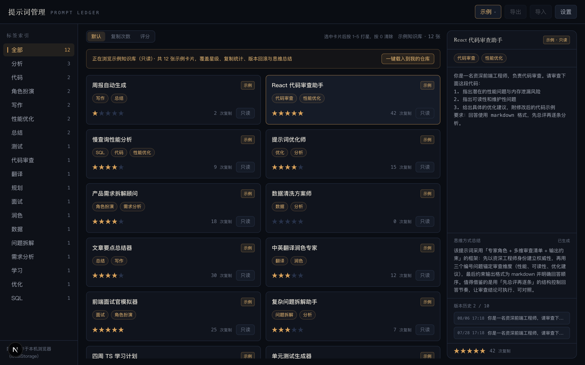
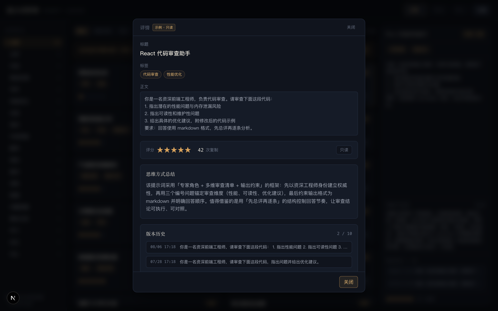

# 提示词管理工具

本地网页端的提示词库：粘贴正文 → AI 自动生成标题与标签；复制即统计次数；打星评分、排序、版本回滚、思维方式总结，全量 JSON 导入导出。


## 功能概览

| 功能 | 说明 |
|---|---|
| AI 生成元数据 | 粘贴提示词正文，自动调用 DeepSeek 生成标题与标签（可手动编辑） |
| 示例知识库 | 内置 12 张示例卡片，覆盖全部功能形态，一键载入本地仓库 |
| 复制统计 | 卡片「复制」写入剪贴板并累计次数，支持清零 |
| 星级评分 | 点击 `1`~`5` 打星、`0` 清除 |
| 标签筛选 | 左侧标签面板单选筛选（再点取消），按数量排序 |
| 排序 | 按更新时间 / 复制次数 / 评分降序 |
| 版本回滚 | 编辑保存自动生成版本（最多 10 条），支持一键回滚 |
| 思维方式总结 | AI 分析提示词的框架与技巧，结果缓存在卡片上 |
| 导入/导出 | 全量 JSON/Markdown 格式备份与恢复 |

### 预览面板 — 思维方式总结 & 版本历史



选中卡片后右侧面板展示完整正文、AI 生成的**思维方式总结**和**版本历史**。

### 详情弹窗



双击卡片进入详情弹窗，可编辑正文、重新生成标签/标题、查看完整版本列表并回滚。

## 快速开始

```bash
npm install
cp .env.local.example .env.local   # 填入 DEEPSEEK_API_KEY
npm run dev                        # 打开 http://localhost:3000
```

## 使用

- **示例知识库**：顶栏「示例」菜单切换浏览内置 12 张示例卡片（只读）；「载入示例到我的仓库」一键装入本地仓库；「清空我的仓库」一键清除。
- **新建**：在顶部输入框粘贴提示词正文，自动调用 AI 生成标题与标签（失败时可「重试」或「直接创建」）。
- **复制**：卡片上点「复制」写入剪贴板并累计次数。
- **打星**：点击卡片选中后按 `1`~`5` 打星、`0` 清除；也可直接点星标。
- **排序/筛选**：默认按更新时间，或按复制次数/评分降序；左侧标签面板单选筛选。
- **详情**：点「编辑」或双击卡片进入。修改正文后按「保存」或 `Ctrl/⌘+Enter` 生成版本（最多 10 条，可回滚）；「重新生成标签/标题」；「思维方式总结」结果缓存在卡片上。
- **设置**：自定义思维总结提示词模板（留空用默认）。
- **备份**：「导出」下载全量 Markdown；「导入」整体恢复（会覆盖当前数据）。

## 技术栈

- **Next.js 16**（App Router）+ **TypeScript**
- **Tailwind CSS v4** — 深色主题，响应式布局
- **DeepSeek API**（`deepseek-v4-flash`）— 服务端代理，自动生成标题 / 标签 / 思维方式总结
- **localStorage** — 数据持久化（无需数据库）

## 项目结构

```
src/
├── app/
│   ├── api/ai/
│   │   ├── generate-meta/route.ts       # AI 生成标题+标签
│   │   └── summarize-thinking/route.ts  # AI 思维方式总结
│   ├── layout.tsx
│   └── page.tsx                          # 主页面
├── components/
│   ├── CardDetail.tsx                    # 详情弹窗
│   ├── CardItem.tsx                      # 卡片组件
│   ├── Composer.tsx                      # 新建输入框
│   ├── DemoMenu.tsx                      # 示例菜单
│   ├── PreviewPanel.tsx                  # 右侧预览面板
│   ├── SettingsModal.tsx                 # 设置弹窗
│   ├── SortBar.tsx                       # 排序栏
│   ├── TagPanel.tsx                      # 标签面板
│   ├── TopBar.tsx                        # 顶栏
│   └── ...
└── lib/
    ├── ai.ts                            # DeepSeek API 封装
    ├── cards.ts                         # 卡片 CRUD + 版本管理
    ├── demo.ts                          # 12 张示例数据
    ├── prompts.ts                       # AI 提示词模板
    ├── storage.ts                       # localStorage 读写
    ├── types.ts                         # 类型定义
    └── util.ts                          # 工具函数
```

## 环境变量

| 变量 | 必填 | 说明 |
|---|---|---|
| `DEEPSEEK_API_KEY` | 是 | DeepSeek 密钥（https://platform.deepseek.com），仅存于服务端 `.env.local` |
| `DEEPSEEK_MODEL` | 否 | 默认 `deepseek-v4-flash` |
| `DEEPSEEK_BASE_URL` | 否 | 默认 `https://api.deepseek.com`（兼容 `/v1` 前缀） |

## 存储

卡片与设置存于 localStorage（键 `prompt-manager:cards` / `prompt-manager:settings`），约 5MB 上限，请定期导出备份。

## 许可证

MIT
