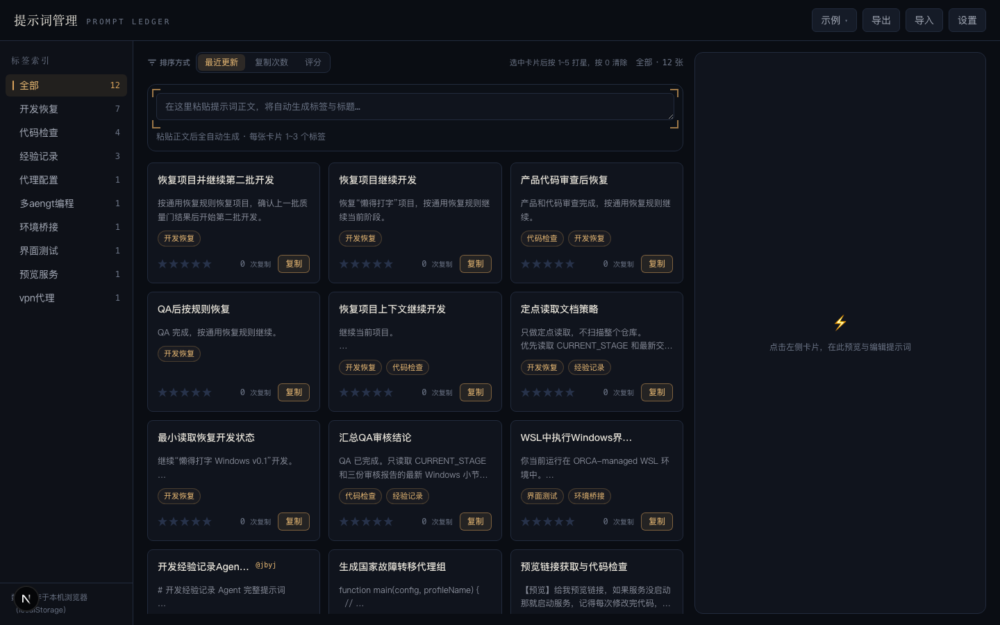

# 提示词管理工具（Prompt Manager）

> 一个本地网页端的**提示词知识库 + Agent 接口**：把常用提示词沉淀成可检索的卡片，复制即统计，支持跨设备实时同步，并可通过 **MCP** 让 WorkBuddy 等 AI Agent 用「调取码」一键把任意卡片注入为系统提示词直接执行。


> 截图为 2026-08-27 前版本（搜索框/标签×/格式规范化/网格删除/主题等新增 UI 以实际页面为准）。

## 🤔 为什么需要它

- **提示词散落各处**：聊天记录、备忘录、Notion、本地 txt……想复用时找不到，复制粘贴易出错。
- **切换 AI 角色麻烦**：每次想让 Agent 扮演「代码审查员 / 翻译 / 提示词优化师」，都要重新粘贴一大段系统提示词。
- **多设备不同步**：电脑 A 整理的提示词，电脑 B 看不到。
- **用了就忘**：哪个提示词最常用、效果最好，没有数据支撑。

**本工具**把这些问题一次性解决：粘贴正文 → AI 自动提炼标题/标签 → 一键复制（统计次数）→ 局域网多端实时同步 → 给常用提示词设「调取码」→ 在 WorkBuddy 里说一句「调取 xxx」就让它以该角色直接开工。

## ✨ 核心亮点

- **AI 自动整理**：粘贴即生成标题与标签，零手工维护。
- **复制即统计**：手动复制与 MCP 调取共用计数，常用提示词一目了然。
- **调取码 → 一键激活**：给卡片设短码，在 Agent 里「调取 <码>」即把正文作为系统提示词注入执行。
- **全局搜索**：SortBar 搜索框（300ms 防抖），支持标题/正文/标签/调取码/备注大小写不敏感检索 + `@code` 直达（仅按调取码匹配）+ `<mark>` 高亮高对比（`--color-highlight` 变量，暗色琥珀 42% + ring / 亮色纸面荧光笔，WCAG AA）+ 命中计数 + 空态引导；刷新即清。
- **网格直删**：卡片网格 hover 卡片时「编辑」下显示红色「删除」，点击按设置决定是否二次确认（设置中可关闭），删除后自动取消选中/详情；只读示例视图隐藏。
- **双主题**：跟随系统 / 暗色 / 亮色三档（设置中切换），首屏内联脚本预置主题防闪烁，system 模式实时跟随系统偏好；CSS 变量驱动全站与高亮自适应。
- **局域网实时同步**：多台电脑共用一份数据，增删改秒级互推。
- **失焦自动保存**：编辑任意字段后失焦即落地（腾讯文档 / 飞书式），无需手动点保存；正文**仅在手动保存或 `Ctrl/⌘+Enter` 时生成版本快照**，失焦仅保存正文不建版，告别「忘记点保存」。
- **版本可追溯**：每次正文保存自动存档（最多 10 版），随时回滚。

## 功能概览

| 功能 | 说明 |
|---|---|
| AI 生成元数据 | 粘贴提示词正文，自动调用 DeepSeek 生成标题与标签（可手动编辑）；AI 无法判断领域时标签留空（`DISCARD_TAGS` 过滤「无法分类/未分类/其他/无/无标签」，提示词约束禁止占位标签，存量脏标签由标签管理手动清理） |
| 示例知识库 | 内置 12 张示例卡片（自带调取码），覆盖全部功能形态，一键载入本地仓库 |
| 复制统计 | 卡片「复制」写入剪贴板并累计次数；**MCP 调取同样计入**；支持清零 |
| 调取码（code） | 用户自定义短码（英文/数字/短横线，≤12 字符，大小写不敏感，可选填），供 MCP 调取；输入时标题 `x/20`、调取码 `x/12` 实时计数，非法字符即时过滤并提示「仅支持英文/数字/短横线」 |
| MCP 集成 | 子包 `mcp/prompt-server/`，工具 `prompt_manager_activate_prompt(code)`：取卡片并立即将其正文作为新的系统提示词注入会话 |
| 全局搜索 | SortBar 搜索框（300ms 防抖，纯前端过滤），范围标题/正文/标签/调取码/备注（大小写不敏感）+ `@code` 直达（仅按调取码匹配）+ `<mark>` 纯文本高亮（XSS 免疫）+ 「命中 x / 共 y」计数 + 空态引导；**搜索激活时按相关度排序（标题 4 > 调取码/标签 3 > 备注 2 > 正文 1，同分再按更新/复制/评分二级排序；`@code` 隔离保持原排序）**；搜索词不持久化（刷新即清） |
| 星级评分 | 点击 `1`~`5` 打星、`0` 清除 |
| 标签筛选 | 左侧标签面板单选筛选（再点取消），按数量排序；筛选态下新建卡片默认携带当前选中标签（强制首位，其余 AI 标签去重补充，最多 3 个；「全部」与 demo 视图不强制） |
| 标签管理 | 标签行 hover 显示 ×（键盘 focus-visible 可达），点击 confirm「将从 N 张卡片中移除标签…卡片本身不会删除」→ 批量从所有含该标签的卡片移除该条目（原文不动），计数归 0 自动消失；demo 视图隐藏 × |
| 网格直删 | 卡片 hover 时「编辑」下出现 `text-rust` 删除（`group-hover`/`focus-visible` 显示，`stopPropagation`），按 `Settings.confirmDelete` 决定是否 `window.confirm`「确定删除「{title}」？此操作不可撤销。」；预览/详情共用同一 `handleDeleteCard`；demo 隐藏；设置中 Switch 即存可关闭二次确认 |
| 排序 | 按更新时间 / 复制次数 / 评分降序；搜索激活时按相关度（标题 4/调取码·标签 3/备注 2/正文 1）置顶，同分二级排序 |
| 格式规范化 | 保存时自动 `normalizeBody`：逐行去前导 tab、纯空白归一、非空行前导空格最多保留 4 个、去首尾空行、合并连续空行（`\\n{3,}`→`\\n\\n`）；导入（JSON/Markdown）路径同步规范化，保证全篇左对齐 |
| 重复去重 | 新建提交前 `normalizeBody` 全等比对，命中已有内容弹 `confirm`「检测到内容已存在（标题「X」），是否仍要添加？」— 取消不新增、确认继续；空内容/不同内容不弹，首个命中仅一次 |
| 搜索高亮 | `--color-highlight`/`--color-highlight-text`/`--color-highlight-ring` 变量驱动，暗色 `rgba(251,191,36,.42)/#fef3c7` / 亮色 `#fde68a/#78350f` 高对比，`<mark class="bg-highlight text-highlight ring-highlight-ring">` 双主题自适应 |
| 主题切换 | `Settings.theme: 'dark'\|'light'\|'system'`，`DEFAULT_SETTINGS` + `normalizeSettings` 迁移补全；`layout.tsx` 内联脚本 + `suppressHydrationWarning` 防 FOUC；`page.tsx` `theme` useEffect 系统跟随；设置中 select 即存 |
| 备注字段 | 正文上方 2 行可拖动备注，自填「何时用 / 注意事项」，非 AI 生成，失焦自动保存 |
| 自动保存 | 标题 / 标签 / 调取码 / 备注 / 星级失焦即存；正文**手动保存或 `Ctrl/⌘+Enter` 保存并生成版本**；保存后显示「已自动保存」角标 |
| 版本回滚 | 每次正文保存自动生成版本（最多 10 条），支持一键回滚 |
| 思维方式总结 | AI 分析提示词的框架与技巧，结果缓存在卡片上 |
| 跨设备实时同步 | 服务端共享存储 + SSE 推送：同一局域网多台电脑数据实时双向同步 |
| 导入/导出 | 全量 JSON/Markdown 格式备份与恢复（含调取码） |

## 快速开始

### 先决条件

- **Node.js** ≥ 18（推荐 20+）
- **DeepSeek API Key**（https://platform.deepseek.com）

### 安装与运行

```bash
# 1. 安装依赖
npm install

# 2. 配置密钥
cp .env.local.example .env.local
#   编辑 .env.local，填入 DEEPSEEK_API_KEY=sk-xxx

# 3. 启动开发服务
npm run dev
#   打开 http://localhost:3000

# （可选）带 watchdog 自愈地启动，服务挂了 3 秒自动拉起：
./dev-server.sh start        # 启动
./dev-server.sh status       # 查看状态
./dev-server.sh logs         # 查看日志
./dev-server.sh stop         # 停止
```

> 首次打开时若本机已有旧数据（localStorage），会自动迁移上传到服务端。

### 生产部署（可选）

```bash
npm run build
npm run start        # 默认 3000 端口
```

## 局域网实时同步

- 服务监听所有网卡（`*:3000`）。同局域网内其他设备访问 `http://<本机IP>:3000` 即可共用同一份数据（数据存在运行 dev 服务的那台机器上，`data/store.json`）。
- 任意一端增删改，另一端几秒内自动刷新（SSE 推送）。
- `next.config.ts` 的 `allowedDevOrigins` 已放行 `.local` 主机名与常用 IP；**IP 变化时需同步更新并重启**。
- 本机也可用 `.local` 地址：`http://<Mac主机名>.local:3000`（不随 DHCP 变化，比 IP 更稳定）。

## MCP 接入（WorkBuddy / 其他支持 MCP 的 Agent）

1. 构建 MCP server：

   ```bash
   cd mcp/prompt-server && npm install && npm run build
   ```

2. 把 `prompt-manager` 注册到 `~/.workbuddy/mcp.json`（**不带点**；注意 `.mcp.json` 带点的是 connector-proxy 专用，别写错）：

   ```json
   {
     "mcpServers": {
       "prompt-manager": {
         "command": "node",
         "args": ["<项目根>/mcp/prompt-server/dist/index.js"],
         "description": "本地提示词管理库：通过调取码（code）返回卡片正文"
       }
     }
   }
   ```

   > `command` 也可写成 Node 绝对路径（运行 `which node` 查看），确保 WorkBuddy 进程能找到 Node。

3. 在 WorkBuddy「连接器」→「配置 MCP」里保存并**信任**该 server；之后**新开会话**生效。
4. 使用：输入「**调取 <调取码>**」（如 `调取 jbyj`），WorkBuddy 会调用 `prompt_manager_activate_prompt`，把卡片正文作为新的系统提示词直接执行，并给该卡片复制次数 +1。

> 详细接入说明见 `mcp/prompt-server/README.md`。

## 使用指南

- **示例知识库**：顶栏「示例」菜单切换浏览内置 12 张示例卡片（只读）；「载入示例到我的仓库」一键装入本地仓库；「清空我的仓库」一键清除。
- **新建**：在顶部输入框粘贴提示词正文，自动调用 AI 生成标题与标签（失败时可「重试」或「直接创建」）；AI 无法分类时标签留空（不再产生「无法分类」占位）；标签筛选态下新建默认携带当前选中标签（首位）；重复内容提交前弹 confirm 去重（取消不新增）。
- **复制**：卡片上点「复制」写入剪贴板并累计次数；MCP 调取同样 +1。
- **调取码**：右侧面板 / 详情弹窗中填写（`@` 前缀输入框），输入时显示 `x/12` 计数、标题 `x/20` 计数，非法字符即时过滤并提示「仅支持英文/数字/短横线，已自动过滤」；冲突时实时红字提示；卡片上以 `@code` 徽标展示。
- **打星**：点击卡片选中后按 `1`~`5` 打星、`0` 清除；也可直接点星标。
- **搜索**：SortBar 搜索框输入即时过滤（300ms 防抖），支持标题/正文/标签/调取码/备注大小写不敏感匹配；`@` 开头仅按调取码匹配直达；命中片段在卡片标题/正文/标签/调取码徽标以 `<mark class="bg-highlight text-highlight ring-1 ring-highlight-ring">` 高亮高对比（暗色琥珀 42% + 亮色荧光笔，变量驱动双主题，防 XSS）；**搜索激活时按相关度置顶（标题 4 > 调取码/标签 3 > 备注 2 > 正文 1，同分再按排序二级），`@code` 隔离保持原排序**；有值时显示「命中 x / 共 y 张」，0 命中显示空态引导；刷新即清。
- **标签管理**：左侧标签行 hover（或键盘聚焦）显示 ×，点击 confirm 批量从所有含该标签的卡片移除该条目（卡片原文不动，计数归 0 自动消失）；demo 视图不显示 ×。
- **网格直删**：网格卡片 hover 时「编辑」下出现红色「删除」，按 `confirmDelete` 是否二次确认后删除；设置 →「删除前二次确认」Switch 可关闭确认（即点即删）。
- **主题**：设置 →「外观主题」跟随系统 / 暗色 / 亮色即时切换并持久化（刷新保持、服务端同步），首屏无闪烁，system 实时跟随系统偏好。
- **排序/筛选**：排序栏以「排序方式」标签明确标识，提供「最近更新 / 复制次数 / 评分」三档（悬浮可看说明），作用于当前集合；左侧标签面板单选筛选，与搜索 AND 叠加。
- **格式规范化**：正文保存时自动左对齐（去前导 tab/多余空格、合并连续空行、去首尾空行，保留最多 4 空格 Markdown 缩进）；导入备份同步规范化。
- **详情**：点「编辑」或双击卡片进入。修改正文后按「保存」或 `Ctrl/⌘+Enter` 生成版本（最多 10 条，可回滚）；「重新生成标签/标题」；「思维方式总结」结果缓存在卡片上。
- **备注**：正文上方 2 行可拖动备注，自填「何时用 / 注意事项」等非 AI 内容；边输入边存（停手 700ms 自动落库）或失焦保存。
- **自动保存**：标题 / 标签 / 调取码 / 备注 / 星级为失焦即存（腾讯文档、飞书式）；正文**手动保存或按 `Ctrl/⌘+Enter` 保存并生成版本**，失焦仅保存正文不建版。保存后底部显示「已自动保存」角标，手动「保存」按钮给出「已保存」提示——不再有「忘记保存」的担忧。
- **右侧面板（正文优先）**：以「给正文最大空间」为设计原则，元信息区压缩到最小、正文占据约 80% 纵向空间且字号更大；思维总结 / 版本历史默认折叠；面板左缘可拖动调宽（默认 420px，范围 320–720px，双击重置）。
- **设置**：自定义思维总结提示词模板（留空用默认）。
- **备份**：「导出」下载全量 Markdown；「导入」整体恢复（会覆盖当前数据）。

## 技术栈

- **Next.js 16**（App Router）+ **React 19** + **TypeScript 5**
- **Tailwind CSS v4** — 深色主题，响应式布局
- **DeepSeek API**（`deepseek-v4-flash`）— 服务端代理，自动生成标题 / 标签 / 思维方式总结
- **服务端共享存储** — `serverStore` 进程内单例 + `data/store.json` 落盘 + SSE 实时推送
- **MCP** — `@modelcontextprotocol/sdk`（stdio），独立子包 `mcp/prompt-server/`

## 项目结构

```
src/
├── app/
│   ├── api/
│   │   ├── ai/
│   │   │   ├── generate-meta/route.ts       # AI 生成标题+标签
│   │   │   └── summarize-thinking/route.ts  # AI 思维方式总结
│   │   └── sync/
│   │       ├── route.ts                     # 共享存储 GET 快照 / POST 覆盖
│   │       ├── stream/route.ts              # SSE 实时推送
│   │       └── increment-copy/route.ts      # MCP 调用计数（copyCount +1）
│   ├── layout.tsx
│   └── page.tsx                             # 主页面
├── components/
│   ├── CardDetail.tsx                       # 详情弹窗
│   ├── CardItem.tsx                         # 卡片组件（含 2 行正文预览、@code 徽标）
│   ├── Composer.tsx                         # 新建输入框
│   ├── DemoMenu.tsx                         # 示例菜单
│   ├── PreviewPanel.tsx                     # 右侧预览面板（可拖动宽度、折叠区、调取码输入）
│   ├── SettingsModal.tsx                    # 设置弹窗
│   ├── SortBar.tsx                          # 排序栏
│   ├── TagPanel.tsx                         # 标签面板
│   ├── TopBar.tsx                           # 顶栏
│   └── ...
└── lib/
    ├── ai.ts                                # DeepSeek API 封装
    ├── cards.ts                             # 卡片 CRUD + 版本管理 + 调取码规范化
    ├── demo.ts                              # 12 张示例数据
    ├── prompts.ts                           # AI 提示词模板
    ├── serverStore.ts                       # 服务端共享存储（单例 + 落盘 + 广播）
    ├── storage.ts                           # localStorage 兜底 + 服务端同步层
    ├── types.ts                             # 类型定义
    └── util.ts                              # 工具函数
mcp/prompt-server/
├── src/index.ts                             # MCP server（prompt_manager_activate_prompt）
├── package.json / tsconfig.json
└── README.md                                # MCP 接入说明
dev-server.sh                                # dev 服务 watchdog 管理脚本
```

## 环境变量

| 变量 | 必填 | 说明 |
|---|---|---|
| `DEEPSEEK_API_KEY` | 是 | DeepSeek 密钥（https://platform.deepseek.com），仅存于服务端 `.env.local` |
| `DEEPSEEK_MODEL` | 否 | 默认 `deepseek-v4-flash` |
| `DEEPSEEK_BASE_URL` | 否 | 默认 `https://api.deepseek.com`（兼容 `/v1` 前缀） |
| `PROMPT_MANAGER_API_URL` | 否 | MCP server 计数 API 地址，默认 `http://localhost:3000` |

## 存储与备份

- **同步源**：服务端 `data/store.json`（`serverStore` 落盘，含用户提示词，已被 `.gitignore` 忽略）。
- **离线兜底**：localStorage（键 `prompt-manager:cards` / `prompt-manager:settings`）。
- 首次打开时若服务端为空且本机 localStorage 有数据，会自动迁移上传。
- 请定期「导出」备份。

## 常见问题（FAQ）

**Q：另一台电脑打不开 / 无法同步？**
A：确认运行 dev 服务的那台电脑 `npm run dev` 仍在运行；对方用 `http://<本机IP或.local>:3000` 访问。若提示跨域拦截，把该 IP/主机名加入 `next.config.ts` 的 `allowedDevOrigins` 并重启。

**Q：IP 变了之后同步失效？**
A：路由器重分配 IP 后，旧 IP 失效。改用 `.local` 主机名访问，或更新 `allowedDevOrigins` 里的 IP 并重启服务。

**Q：MCP 调取没反应 / 工具调不起来？**
A：① 确认已在 WorkBuddy「连接器」里**信任**该 server；② MCP 中途启用需**新开会话**才会加载工具元数据；③ 用「调取 / 激活 / 加载」+ 短码触发（如 `调取 jbyj`）。

**Q：调取码冲突怎么办？**
A：右侧面板或详情弹窗填写调取码时，若已存在会实时红字提示，换一个即可。

**Q：复制次数不更新？**
A：手动复制实时生效；MCP 调取计数需要 dev 服务运行且 `PROMPT_MANAGER_API_URL`（默认 `http://localhost:3000`）可达，计数失败不影响取卡片。

**Q：AI 生成标题/标签失败？**
A：检查 `.env.local` 中 `DEEPSEEK_API_KEY` 是否正确，以及网络能否访问 DeepSeek。失败时可手动「直接创建」。

## 许可证

MIT
