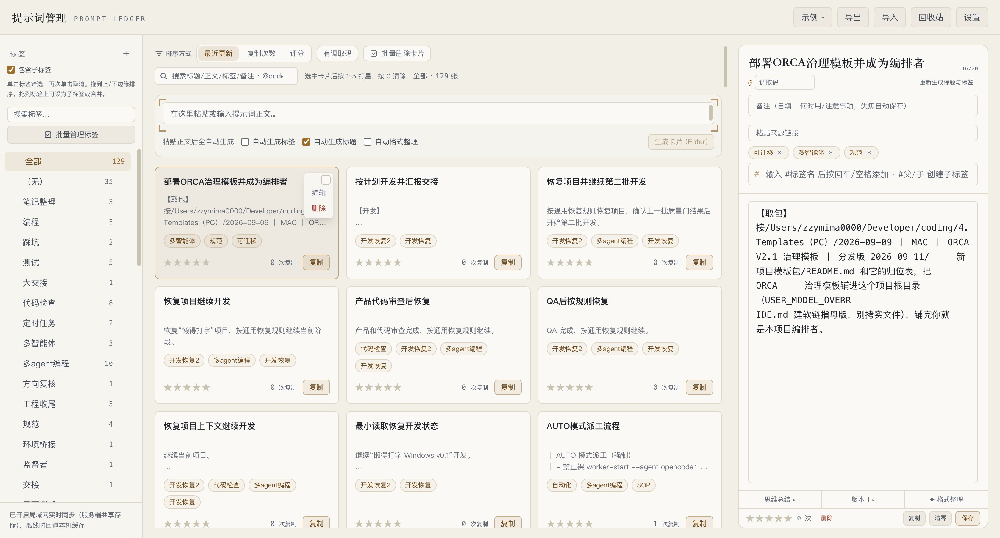

# 提示词管理工具（Prompt Manager）

[English](./README.en.md)

> 一个本地网页端的**提示词知识库 + Agent 接口**：把常用提示词沉淀成可检索的卡片，复制即统计，数据存储在本地 SQLite，并可通过 **MCP** 让 WorkBuddy 等 AI Agent 用「调取码」一键把任意卡片注入为系统提示词直接执行。


> 截图为 2026-10-05 实际页面（卡片详情编辑态），数据为本机真实使用数据。

## 🤔 为什么需要它

- **提示词散落各处**：聊天记录、备忘录、Notion、本地 txt……想复用时找不到，复制粘贴易出错。
- **切换 AI 角色麻烦**：每次想让 Agent 扮演「代码审查员 / 翻译 / 提示词优化师」，都要重新粘贴一大段系统提示词。
- **多设备不同步**：电脑 A 整理的提示词，电脑 B 看不到。
- **用了就忘**：哪个提示词最常用、效果最好，没有数据支撑。

**本工具**把这些问题一次性解决：粘贴正文 → AI 自动提炼标题/标签 → 一键复制（统计次数）→ 局域网多端实时同步 → 给常用提示词设「调取码」→ 在 WorkBuddy 里说一句「调取 xxx」就让它以该角色直接开工。

## ✨ 核心亮点

- **AI 自动整理**：粘贴即生成标题与标签，零手工维护。
- **复制即统计**：手动复制与 MCP 调取共用计数，常用提示词一目了然。
- **调取码 → 一键激活**：给卡片设短码，在 Agent 里「调取 <码>」即把正文作为系统提示词注入执行。
- **全局搜索**：SortBar 搜索框（300ms 防抖），支持标题/正文/标签/调取码/备注大小写不敏感检索 + `@code` 直达（仅按调取码匹配）+ `<mark>` 高亮高对比（`--color-highlight` 变量，暗色琥珀 42% + ring / 亮色纸面荧光笔，WCAG AA）+ 命中计数 + 空态引导；刷新即清。
- **网格直删**：卡片网格 hover 卡片时「编辑」下显示红色「删除」，点击按设置决定是否二次确认（设置中可关闭），删除后自动取消选中/详情；只读示例视图隐藏。
- **双主题**：跟随系统 / 暗色 / 亮色三档（设置中切换），首屏内联脚本预置主题防闪烁，system 模式实时跟随系统偏好；CSS 变量驱动全站与高亮自适应。
- **局域网实时同步**：多台电脑共用一份数据，增删改秒级互推。
- **失焦自动保存**：编辑任意字段后失焦即落地（腾讯文档 / 飞书式），无需手动点保存；正文**仅在手动保存或 `Ctrl/⌘+Enter` 时生成版本快照**，失焦仅保存正文不建版，告别「忘记点保存」。
- **版本可追溯**：每次正文保存自动存档（最多 10 版），随时回滚。

## 功能概览

| 功能 | 说明 |
|---|---|
| AI 生成元数据 | 粘贴提示词正文，自动调用 DeepSeek 生成标题与标签（可手动编辑）；AI 无法判断领域时标签留空（`DISCARD_TAGS` 过滤「无法分类/未分类/其他/无/无标签」，提示词约束禁止占位标签，存量脏标签由标签管理手动清理） |
| 示例知识库 | 内置 12 张示例卡片（自带调取码），覆盖全部功能形态，一键载入本地仓库 |
| 复制统计 | 卡片「复制」写入剪贴板并累计次数；**MCP 调取同样计入**；支持清零 |
| 调取码（code） | 用户自定义短码（英文/数字/短横线，≤12 字符，大小写不敏感，可选填），供 MCP 调取；输入时标题 `x/20`、调取码 `x/12` 实时计数，非法字符即时过滤并提示「仅支持英文/数字/短横线」 |
| MCP 集成 | 子包 `mcp/prompt-server/`，工具 `prompt_manager_activate_prompt(code)`：通过独立、可撤销令牌从本机 HTTP API 调取卡片并立即将其正文作为新的系统提示词注入会话 |
| 全局搜索 | SortBar 搜索框（300ms 防抖，纯前端过滤），范围标题/正文/标签/调取码/备注（大小写不敏感）+ `@code` 直达（仅按调取码匹配）+ `<mark>` 纯文本高亮（XSS 免疫）+ 「命中 x / 共 y」计数 + 空态引导；**搜索激活时按相关度排序（标题 4 > 调取码/标签 3 > 备注 2 > 正文 1，同分再按更新/复制/评分二级排序；`@code` 隔离保持原排序）**；搜索词不持久化（刷新即清） |
| 星级评分 | 点击 `1`~`5` 打星、`0` 清除 |
| 标签筛选 | 左侧标签面板单选筛选（再点取消），按数量排序；筛选态下新建卡片默认携带当前选中标签（强制首位，其余 AI 标签去重补充，最多 3 个；「全部」与 demo 视图不强制） |
| 标签系统（ID 解耦） | `tags` 11 + `promptTags` 55（多age×3/多aengt×1→多agent编程，无法分类删除，0孤儿），`Tag`/`PromptTag` ID 解耦，`src/lib/tags.ts` 纯函数 11/55迁移（守卫+树构建+循环/重名检测+8 mutation + `syncCardsToPromptTags`），`TagPanel` 树+展开记忆+完整路径搜索+无标签+`⋯` 重命名/移动/删除（双模式级联不删 Prompt，确认），当前标签下新建继承，多标签上限3保持，`cards.ts:50字` 根因修复，`scripts/migrate-tags.mjs` 一键迁移  |
| 标签 chip 双写 | 编辑卡片标签 chip `×` 移除时 `handleUpdateMeta` 双写 `card.tags` 与 `promptTags`（`resolveTagIds→setCardTags→syncCardsToPromptTags`），重命名回滚修复（宏任务 `schedulePush` 合并避免 SSE 回声回滚），新建标签父校验 `parentId` 存在性检查；`BUG-NEW-1 CLOSED`；卡片/预览/详情三处 chips 显示完整路径 `父/子`（`promptTagPathsOf`，同名不同父可区分，无关联回退原名） |
| 标签管理 | 标签行 hover 显示 ×（键盘 focus-visible 可达），点击 confirm「将从 N 张卡片中移除标签…卡片本身不会删除」→ 批量从所有含该标签的卡片移除该条目（原文不动），计数归 0 自动消失；demo 视图隐藏 × |
| 标签添加交互（P0-9） | 详情/预览面板标签区重构为 flomo 风格 `TagEditor`：输入 `#标签名` 后**回车或空格**即自动添加为 chip（禁止逗号/顿号分隔），每次只加一个标签互不干扰；输入时弹出已有标签下拉补全（点选/回车即加）；chip 上 × 移除单个；已达上限（默认 3 个）红色提示；失焦兜底提交未写完标签；与 `handleUpdateMeta` 的 `tagsText` 编辑链路双向兼容（`parseTags`/`join('、')`） |
| 网格直删 | 卡片 hover 时悬浮胶囊 `absolute top-2 right-2 bg-ink-900/80 backdrop-blur`（`group-hover`/`focus-within`/`bulkActive` 显隐）内含多选/编辑/删除，`text-rust` 删除按 `Settings.confirmDelete` 决定是否 `window.confirm`「确定删除「{title}」？可在回收站恢复。」；标题 `pr-16` 预留位 code 徽标不被盖，正文 `line-clamp-3` 空白回收；demo 隐藏；设置中 Switch 即存（2026-08-28 12项 PASS） |
| 回收站 | 顶栏「回收站（n）」：删卡片（单个/批量）与删标签先进站（本机 `pm:trash` 快照，上限 100），条目可恢复（幂等补缺失 id，恢复走正常链路重新上云），仅手动「清空」彻底删除；与 10s 撤销栈共存（2026-09-16 真机 QA PASS） |
| 排序 | 按更新时间 / 复制次数 / 评分降序；搜索激活时按相关度（标题 4/调取码·标签 3/备注 2/正文 1）置顶，同分二级排序 |
| 格式规范化 | 保存时自动 `normalizeBody`：逐行去前导 tab、纯空白归一、非空行前导空格最多保留 4 个、去首尾空行、合并连续空行（`\\n{3,}`→`\\n\\n`）；导入（JSON/Markdown）路径同步规范化，保证全篇左对齐 |
| 重复去重 | 新建提交前 `normalizeBody` 全等比对，命中已有内容弹 `confirm`「检测到内容已存在（标题「X」），是否仍要添加？」— 取消不新增、确认继续；空内容/不同内容不弹，首个命中仅一次 |
| 搜索高亮 | `--color-highlight`/`--color-highlight-text`/`--color-highlight-ring`/`--color-highlight-shadow` 变量驱动，暗 `#fbbf24/#111111` 11.3:1 实底黑字外发光 / 亮 `color-mix 50% #fcd34d/#451a03` 12.5:1 半透明深棕强描边（根因：`text-highlight`→`--color-highlight-text` 修复遮挡），`rounded-[3px] px-[1px] shadow` 双主题自适应 |
| 主题切换 | `Settings.theme: 'dark'\|'light'\|'system'`，`DEFAULT_SETTINGS` + `normalizeSettings` 迁移补全；`layout.tsx` 内联脚本 + `suppressHydrationWarning` 防 FOUC；`page.tsx` `theme` useEffect 系统跟随；设置中 select 即存 |
| 评分守卫 | 详情/设置弹窗打开时 `if (detailId \|\| showSettings) return` 屏蔽全局 `1-5` 评分，避免误触背景卡 |
| 空/离线横幅 | `serverOnline` 三态（null 连接中 / false 离线 rust 横幅 + 重试 / true 在线），与「仓库空」文案区分可恢复 |
| Composer 自适应 | 粘贴长文自动 `autoResize` 至 `maxRows=6`（`resize-none`），无需手动拖高 |
| 导入详情 | `SkippedCard` + `describeCardFailure` 字段级原因，`parseMarkdownImport` 空正文入 skipped，`parseImport` JSON 部分导入；`Toast` detail 可滚动列表 6s 展示 |
| 版本节流 | 失焦仅保存不建版（`saveBodyOnly` 全等比较），手动保存/`Ctrl+Enter` 才 `saveBodyWithVersion` 建版，节流合并避免占满 |
| 撤销栈 | 删除/清空等 4 类危险操作 10s 内 `notifyWithUndo` + `undoRef` 撤销，`Toast`  detail 展示 |
| 批量管理 | `bulkIds` Set + 卡片 checkbox（`role="checkbox"`）+ 顶部操作栏（打标签/打星/导出/删除/取消选择）+ 撤销栈 10s（2026-08-28 12项 PASS，API 33→32） |
| 移动端抽屉 | `<md` 时预览面板为底部 `fixed` 抽屉（`max-h-[75dvh]` + `onClose` 收起），`md` 恢复侧边栏 |
| 备注防丢 | `notesTimer` 700ms 防抖，`useEffect` cleanup + 切卡 `commitSave` flush，避免丢字/错卡 |
| 版本 diff | `VersionDiff` + `lineDiff` LCS 行级 diff，版本历史展开高亮对比 |
| 备注字段 | 正文上方 2 行可拖动备注，自填「何时用 / 注意事项」，非 AI 生成，失焦自动保存 |
| 自动保存 | 标题 / 标签 / 调取码 / 备注 / 星级失焦即存；正文**手动保存或 `Ctrl/⌘+Enter` 保存并生成版本**；保存后显示「已自动保存」角标 |
| 版本回滚 | 每次正文保存自动生成版本（最多 10 条），支持一键回滚 |
| 思维方式总结 | AI 分析提示词的框架与技巧，结果缓存在卡片上 |
| 跨设备实时同步 | 服务端共享存储 + SSE 推送：同一局域网多台电脑数据实时双向同步 |
| 导入/导出 | 全量 JSON/Markdown 格式备份与恢复（含调取码）；导入 picker 支持 `.json` + `.md`（`accept=".json,.md"`），与 Markdown 导出可逆；导入结果带 `skipped` 详情（成功 N/跳过 M + 字段级原因） |
| 离线文案 | TagPanel 底部在线「已开启局域网实时同步（服务端共享存储），离线时回退本机缓存」/ 离线「未连接同步服务，已使用本机本地数据」，与存储架构一致 |
| 关闭不丢稿 | 详情弹窗 Esc/蒙层/关闭按钮与移动端抽屉收起前先 `commitSave(true)` flush 未保存草稿（含 700ms 防抖备注），切换卡片时 likewise，切卡/关闭不再静默丢稿 |
| 删除影响数 | 删除标签前 confirm 展示「当前有 N 条提示词使用此标签（或其子标签）」+ 子标签名顿号列出（`totalCount` 子树去重），卡片 32→32 绝不删 Prompt |
| 标签 10s 撤销 | 创建/重命名/移动/删除四类标签操作 Toast 内「撤销」10s（`captureTagSnapshot`/`restoreTagSnapshot` 三态快照），真机 vpn 删除→撤销后标签/关联/冗余 tags 全复原 |
| 服务端校验 | `validateTagGraph` 五项（同父无重名/id 唯一/父级存在/无环/关联不悬空/(prompt_id,tag_id) 唯一）+ `serverStore.setState` 落盘前拒绝 + 客户端 `sanitizePromptTags` 自愈，非法数据均 `数据校验失败` 不落盘 |
| 版本号提交 | `knownVersion`/`baseVersion` 乐观并发：版本不一致 `conflict` 拒绝 → 刷新权威数据 → 重载视图 + toast「检测到其他设备更新…请重试」+ SSE `lastPushedVersion` 回声过滤 |

## 快速开始

### 先决条件

- **Node.js** ≥ 24（推荐 24+，内置 `node:sqlite`）
- **AI API Key**（3 家选 1：DeepSeek 官方 / OpenRouter / OpenCode（Zen 免费版或 Go 付费版），当前默认 `opencode-go`：https://opencode.ai/zen/go/v1）
- **Supabase 账号**（可选，用于多端同步；不填则纯本地 SQLite 单机模式）

### 安装与运行

```bash
# 1. 安装依赖
npm install

# 2. 配置密钥
cp .env.local.example .env.local
#   编辑 .env.local，填入 AI_API_KEY=sk-xxx（或 AI_PROVIDER/AI_MODEL/AI_BASE_URL 组合）
#   多端同步可选填 NEXT_PUBLIC_SUPABASE_URL / NEXT_PUBLIC_SUPABASE_PUBLISHABLE_KEY（留空=本地单机）

# 3. 启动开发服务
npm run dev
#   打开 http://192.168.31.60:3100 并登录云端（勿用 localhost:3100，回跳白名单限制）

# （可选）带 watchdog 自愈地启动，服务挂了 3 秒自动拉起：
./dev-server.sh start        # 启动（3100 已被 Docker 占用时禁止）
./dev-server.sh status       # 查看状态
./dev-server.sh logs         # 查看日志
./dev-server.sh stop         # 停止
```

> 本地 SQLite 为唯一主存储（`data/prompt-manager.db`，WAL 模式）；配置了 Supabase 时可多端同步，否则纯本地单机。

### 生产部署（Docker / Mac Mini）

本项目的正式运行模型是：**Mac Mini 运行唯一一个 Docker 容器，PC 和其他 Mac 只用浏览器访问它**。PC 不需要安装 Node、拉取项目或运行 `npm run dev`。

```text
PC / 其他 Mac 浏览器
        ↓  http://192.168.31.60:3100（已核验，勿用 localhost/.local）
Mac Mini Docker：Prompt Manager Web 服务（0.0.0.0:3100 单容器）
        ↓  SQLite（/app/data/prompt-manager.db，bind mount 到 DockerData）
DockerData/prompt-manager/legacy-store（宿主机磁盘持久化）
```

Docker 配置文件位于项目根目录的 `Dockerfile`、`compose.yaml` 与 `.dockerignore`。它们是部署模板，**不是**在开发目录直接运行正式服务的授权：正式代码须先从开发源码区通过 Git 部署流程更新到：

```text
/Users/zzymima0000/Services/prompt-manager/
```

在该正式目录中，先复制项目内的 `docker/env.template` 为不提交 Git 的 `.env.local`，再填写占位符并至少确认：

```bash
cp docker/env.template .env.local
```

```dotenv
NEXT_PUBLIC_APP_URL=http://Mac-mini.local:3100
PROMPT_MANAGER_DATA_DIR=/Users/zzymima0000/DockerData/prompt-manager/legacy-store
PROMPT_MANAGER_PORT=3100
```

`NEXT_PUBLIC_SUPABASE_URL` 与 `NEXT_PUBLIC_SUPABASE_PUBLISHABLE_KEY` 可选（留空=本地单机模式）；它们是公开浏览器配置。`DEEPSEEK_API_KEY`、MCP 令牌及所有 Secret 仍只能留在 `.env.local`，不得放进 Dockerfile、compose 文件或 Git。

在创建好上述业务持久化目录后，从 `Services/prompt-manager` 运行：

```bash
docker compose --env-file .env.local up -d --build
docker compose ps
```

访问地址固定为：`http://Mac-mini.local:3100`。只在局域网内使用，不要在路由器上配置端口转发。若要让其他设备登录，Supabase Auth 的 **Site URL** 与 Redirect URLs 都应加入这个精确地址；Google Cloud 的 Authorized JavaScript origin 也应加入该地址，但 Google 的 Authorized redirect URI 仍只能是 Supabase 显示的 `/auth/v1/callback`，不是 3100 端口。

> Docker 不会运行 Supabase 数据库，也不会创建数据库 Volume。SQLite 是唯一主数据源（`/app/data/prompt-manager.db`，bind mount 到 `DockerData/prompt-manager/legacy-store` 宿主机持久化）；备份用 `bash scripts/backup-sqlite.sh backup`，产物统一放在 `/Users/zzymima0000/DockerBackups/prompt-manager/`，不能提交 Git。

> 端口统一为 **3100**（`package.json` 的 dev/start 与 `dev-server.sh` 的 `PORT`）。MCP 通过本机 HTTP API（`/api/mcp/activate`）调取卡片，不再直连 Supabase。

## 数据存储

- **主数据源为本地 SQLite**（`data/prompt-manager.db`，WAL 模式 + FK + busy_timeout=5000），2026-09-28 从 Supabase 迁移到本地，降低对网络和第三方的依赖。
- Migration 版本化（`db/migrations/`），首次启动自动建表；备份用 `bash scripts/backup-sqlite.sh backup`（VACUUM INTO 在线热备），恢复用 `bash scripts/backup-sqlite.sh restore <file>`。
- 可选多端同步：配置 `NEXT_PUBLIC_SUPABASE_URL` + `NEXT_PUBLIC_SUPABASE_PUBLISHABLE_KEY` 后启用 Supabase Realtime（cards/card_versions/tags/prompt_tags/settings 5 表），未配置则纯本地单机。
- 认证（可选）：Supabase Auth（Magic Link + Google OAuth PKCE）；固定访问地址 `http://192.168.31.60:3100`。
- Docker 自托管：`0.0.0.0:3100` 单容器，SQLite 数据库 bind mount 到 `DockerData/prompt-manager/legacy-store`（宿主机磁盘持久化），备份统一在 `/Users/zzymima0000/DockerBackups/prompt-manager/`（不进 Git）。

## MCP 接入（WorkBuddy / 其他支持 MCP 的 Agent）

1. 在提示词管理器打开「设置 → MCP 本机访问」，为这台电脑生成令牌；复制一次性内容并保存到 `mcp/prompt-server/.env.local`（参考 `.env.example`）。

2. 构建 MCP server：

   ```bash
   cd mcp/prompt-server && npm install && npm run build
   ```

3. 把 `prompt-manager` 注册到 `~/.workbuddy/mcp.json`（**不带点**；注意 `.mcp.json` 带点的是 connector-proxy 专用，别写错）：

   ```json
   {
     "mcpServers": {
       "prompt-manager": {
         "command": "node",
         "args": ["<项目根>/mcp/prompt-server/dist/index.js"],
          "description": "本机提示词库：通过调取码（code）返回卡片正文"
       }
     }
   }
   ```

   > `command` 也可写成 Node 绝对路径（运行 `which node` 查看），确保 WorkBuddy 进程能找到 Node。

4. 在 WorkBuddy「连接器」→「配置 MCP」里保存并**信任**该 server；之后**新开会话**生效。
5. 使用：输入「**调取 <调取码>**」（如 `调取 jbyj`），WorkBuddy 会调用 `prompt_manager_activate_prompt`，把卡片正文作为新的系统提示词直接执行，并在云端给该卡片复制次数 +1。

> 详细接入说明见 `mcp/prompt-server/README.md`。

## 使用指南

- **示例知识库**：顶栏「示例」菜单切换浏览内置 12 张示例卡片（只读）；「载入示例到我的仓库」一键装入本地仓库；「清空我的仓库」一键清除。
- **新建**：在顶部输入框粘贴提示词正文，自动调用 AI 生成标题与标签（失败时可「重试」或「直接创建」）；AI 无法分类时标签留空（不再产生「无法分类」占位）；标签筛选态下新建默认携带当前选中标签（首位）；重复内容提交前弹 confirm 去重（取消不新增）。
- **复制**：卡片上点「复制」写入剪贴板并累计次数；MCP 调取同样 +1。
- **调取码**：右侧面板 / 详情弹窗中填写（`@` 前缀输入框），输入时显示 `x/12` 计数、标题 `x/20` 计数，非法字符即时过滤并提示「仅支持英文/数字/短横线，已自动过滤」；冲突时实时红字提示；卡片上以 `@code` 徽标展示。
- **打星**：点击卡片选中后按 `1`~`5` 打星、`0` 清除；也可直接点星标。
- **搜索**：SortBar 搜索框输入即时过滤（300ms 防抖），支持标题/正文/标签/调取码/备注大小写不敏感匹配；`@` 开头仅按调取码匹配直达；命中片段在卡片标题/正文/标签/调取码徽标以 `<mark class="bg-highlight text-highlight ring-1 ring-highlight-ring">` 高亮高对比（暗色琥珀 42% + 亮色荧光笔，变量驱动双主题，防 XSS）；**搜索激活时按相关度置顶（标题 4 > 调取码/标签 3 > 备注 2 > 正文 1，同分再按排序二级），`@code` 隔离保持原排序**；有值时显示「命中 x / 共 y 张」，0 命中显示空态引导；刷新即清。
- **标签管理**：左侧单击某标签立即切换筛选，再次单击取消；拖到另一标签上/下边缘可排序，拖到标签中央可选择设为子标签或合并（均不删除提示词正文）；hover（或键盘聚焦）可打开更多管理操作；demo 视图只读。
- **添加标签**：详情/预览面板标签区输入 `#标签名` 后按**回车或空格**即自动添加为 chip（不再用逗号分隔多个标签）；输入时弹出已有标签下拉补全，点选或回车即加；chip 上 × 移除单个；达上限（默认 3 个）时输入框下方显示红色「已达上限」提示。
- **网格直删**：网格卡片 hover 时「编辑」下出现红色「删除」，按 `confirmDelete` 是否二次确认后删除；设置 →「删除前二次确认」Switch 可关闭确认（即点即删）。
- **主题**：设置 →「外观主题」跟随系统 / 暗色 / 亮色即时切换并持久化（刷新保持、服务端同步），首屏无闪烁，system 实时跟随系统偏好。
- **排序/筛选**：排序栏以「排序方式」标签明确标识，提供「最近更新 / 复制次数 / 评分」三档（悬浮可看说明），作用于当前集合；左侧标签面板单选筛选（可选择是否包含子标签），与搜索 AND 叠加。
- **格式规范化**：正文保存时自动左对齐（去前导 tab/多余空格、合并连续空行、去首尾空行，保留最多 4 空格 Markdown 缩进）；导入备份同步规范化。
- **详情**：点「编辑」或双击卡片进入。修改正文后按「保存」或 `Ctrl/⌘+Enter` 生成版本（最多 10 条，可回滚）；「重新生成标签/标题」；「思维方式总结」结果缓存在卡片上。
- **备注**：正文上方 2 行可拖动备注，自填「何时用 / 注意事项」等非 AI 内容；边输入边存（停手 700ms 自动落库）或失焦保存。
- **自动保存**：标题 / 标签 / 调取码 / 备注 / 星级为失焦即存（腾讯文档、飞书式）；正文**手动保存或按 `Ctrl/⌘+Enter` 保存并生成版本**，失焦仅保存正文不建版。保存后底部显示「已自动保存」角标，手动「保存」按钮给出「已保存」提示——不再有「忘记保存」的担忧。
- **右侧面板（正文优先）**：标题突出显示，调取码收进标题行；按标题→备注→标签→正文排列，正文获得主要纵向空间；思维总结 / 版本历史默认折叠；面板左缘可拖动调宽（默认 420px，范围 320–720px，双击重置）。
- **设置**：自定义思维总结提示词模板（留空用默认），并提供可展开的 MCP 连接配置、构建和使用说明。
- **备份**：「导出」下载全量 Markdown；「导入」整体恢复（会覆盖当前数据）。

## 技术栈

- **Next.js 16**（App Router）+ **React 19** + **TypeScript 5**
- **Tailwind CSS v4** — 深色主题，响应式布局
- **通用 AI 适配** — `AI_PROVIDER/AI_MODEL/AI_BASE_URL/AI_API_KEY`（3 家：DeepSeek 官方 / OpenRouter / OpenCode，默认 `opencode-go`），`src/lib/ai/` 适配器 + Route Handler 代理，自动生成标题 / 标签 / 思维方式总结
- **云端主存储** — Supabase `prompt_manager` Schema（6 表 + RLS 24 策略 + Realtime 5 表，记录级 `revision` 含 `tags.revision` 修复，`owner_user_id` 归属），已获放行（Migration 7/7）；`/api/sync` + `data/store.json` + SSE 仅作未登录兼容兜底（退场草稿已于 2026-09-04 取消、长期保留）
- **认证** — Supabase Auth（Magic Link + Google OAuth PKCE，`http://192.168.31.60:3100` 白名单）
- **MCP** — `@modelcontextprotocol/sdk`（stdio，v0.2.0 直连 Supabase `prompt_manager.activate_prompt` RPC，能力令牌 SHA-256，`SECURITY DEFINER` 已裁定接受）

## 项目结构

```
src/
├── app/
│   ├── api/
│   │   ├── ai/
│   │   │   ├── generate-meta/route.ts       # AI 生成标题+标签（通用适配器）
│   │   │   ├── summarize-thinking/route.ts  # AI 思维方式总结
│   │   │   └── format-body/route.ts         # AI 正文整理
│   │   ├── mcp-access-tokens/route.ts       # MCP 令牌服务端生成（Node randomBytes + SHA-256，不用 service_role）
│   │   └── sync/
│   │       ├── route.ts                     # 兼容兜底：GET 快照 / POST 整库覆盖（待 410 退役）
│   │       ├── stream/route.ts              # SSE 兼容推送（仅未登录）
│   │       └── increment-copy/route.ts      # 死路由（待移除，已无调用方）
│   ├── layout.tsx
│   └── page.tsx                             # 主页面（cloudMode 分支：Supabase 云端 vs 兼容兜底，写队列 30s 超时自愈）
├── components/
│   ├── CardDetail.tsx / PreviewPanel.tsx    # 详情/预览（TagEditor、失焦自动保存、版本 diff）
│   ├── Composer.tsx                         # 新建输入框（后台 AI 补全）
│   ├── SupabaseAuthControl.tsx              # Supabase Auth（Magic Link + Google PKCE）
│   ├── McpCloudAccess.tsx                   # MCP 云端访问（令牌生成/撤销/复制兜底）
│   ├── TagPanel.tsx / SortBar.tsx / CardItem.tsx / TopBar.tsx / SettingsModal.tsx
│   └── ...
└── lib/
    ├── ai/                                  # 通用 AI 适配器（types/adapter/factory + 3 家服务商）
    ├── supabase/
    │   ├── config.ts / browser.ts           # PROMPT_MANAGER_SCHEMA + 浏览器客户端
    │   ├── promptRepository.ts              # 云端快照/Realtime/revision 写入/标签关系增量/版本追加
    │   └── mcpTokens.ts                     # 令牌哈希/列表/撤销（浏览器仅透传 JWT）
    ├── cards.ts / tags.ts / serverStore.ts  # 卡片/标签纯函数 + 兼容存储（待退役）
    ├── storage.ts                           # localStorage + 兼容同步层（含 sanitize/conflict 回声过滤）
    ├── types.ts / prompts.ts / util.ts
    └── ...
mcp/prompt-server/
├── src/index.ts                             # MCP server（直连 Supabase prompt_manager.activate_prompt RPC）
├── package.json / tsconfig.json
└── README.md                                # MCP 接入说明
supabase/.temp/                              # CLI link 临时文件（.gitignore，不进仓库；真相源在平台仓库）
Dockerfile / compose.yaml / docker/env.template  # Docker 自托管模板（standalone 输出，legacy-store bind mount）
```

## 环境变量

| 变量 | 必填 | 说明 |
|---|---|---|
| `AI_PROVIDER` | 否 | AI 厂商（4 个取值：`deepseek` / `openrouter` / `opencode` / `opencode-go`，默认 `deepseek`） |
| `AI_MODEL` | 否 | 模型名（例 `deepseek-v4-flash` / `glm-5.3-flash`），默认随厂商自动选择 |
| `AI_BASE_URL` | 否 | 自定义 Base URL（留空用厂商默认） |
| `AI_API_KEY` | 是（UI 或 env 二选一） | 厂商 API Key（设置页填入即随设置持久化并云端同步，离线兜底存 localStorage；或填于 `.env.local` 服务端）。**env 里的 Key 只会回退给与 `AI_PROVIDER` 同源的厂商**，避免把 A 家的密钥发到 B 家端点 |
| `DEEPSEEK_API_KEY` / `DEEPSEEK_MODEL` / `DEEPSEEK_BASE_URL` | 兼容 | 旧 DeepSeek 专用变量，`AI_*` 未填时回退（仅 `AI_PROVIDER=deepseek` 时采用） |
| `NEXT_PUBLIC_SUPABASE_URL` | 云端同步必填 | Supabase 项目 URL（`https://yacgnikzvutbpoqvokth.supabase.co`，可公开） |
| `NEXT_PUBLIC_SUPABASE_PUBLISHABLE_KEY` | 云端同步必填 | Supabase publishable key（`sb_publishable_…`，可公开，绝不能使用 `sb_secret_…`/service_role） |
| `NEXT_PUBLIC_APP_URL` | Docker 部署必填 | 统一访问地址 `http://192.168.31.60:3100`（白名单精确地址，勿用 localhost/.local） |
| `PROMPT_MANAGER_DATA_DIR` | Docker 部署必填 | `DockerData/prompt-manager/legacy-store` 绝对路径，仅保留兼容副本 |
| `PROMPT_MANAGER_PORT` | 否 | Docker 对外端口，默认 `3100` |

## 存储与备份

- **主同步源**：Supabase `prompt_manager` 云端（6 表 + RLS + Realtime，记录级 `revision`），已获放行并完成 55 卡基线备份 + 隔离恢复演练全绿（`DockerBackups/prompt-manager/`，生产零写入）。
- **兼容兜底**：未登录时 `data/store.json`（`serverStore` 落盘 + SSE）+ `localStorage`（`prompt-manager:cards/settings`）；该链路曾提交限期退场草稿（POST 将 `410 Gone`），**已于 2026-09-04 经用户最终裁定取消、长期保留只读**。
- 导入：三份本地来源合并导入云端（52 基线 + 授权补传 → 54 当前，含 1 张保留测试卡），外键孤儿 0，`aiApiKey` 永不入云。
- 请定期「导出」备份；`DockerBackups/prompt-manager/` 全量结构/数据/角色 dump 不进 Git。

## 常见问题（FAQ）

**Q：Docker 部署后，PC/另一台 Mac 应该打开哪个地址？**
A：统一打开 `http://192.168.31.60:3100`（当前已核验访问地址），然后登录同一个 Supabase 账号。不要打开本机的 `localhost:3100`（不在白名单，回跳会被静默改送 Site URL 导致“点了没反应”）或 `.local`（易被代理 TUN 劫持 `ERR_EMPTY_RESPONSE`）。详见 `2026-09-02 丨 Mac Mini 本地项目自托管 Docker 规范 丨 V1.0.md`。

**Q：另一台电脑打不开 / 无法同步？**
A：① 确认已登录云端（`SupabaseAuthControl` 显示已登录 `wanghoufan13@gmail.com`，aside 底栏为“已开启 Supabase 云端实时同步”）；② 云端模式走 Supabase Realtime，不依赖 dev 服务是否运行（Docker 需 `docker compose ps` 为 Up）；③ 未登录时才走旧局域网链路（`data/store.json` + SSE），该链路已于 2026-09-04 最终裁定长期保留（BUG-12 备份+合并兜底继续有效）。跨域拦截由 `next.config.ts` 动态 LAN IP 已处理，IP 漂移重启容器即可。

**Q：IP 变了之后同步失效？**
A：云端同步不依赖 LAN IP（走 Supabase 云端）；仅兼容兜底的局域网链路受 IP 影响。当前固定访问地址为 `http://192.168.31.60:3100`，已在 Supabase Dashboard Site URL/Redirect URLs 白名单；若路由器重分配 IP，需更新白名单并重启 Docker。

**Q：MCP 调取没反应 / 工具调不起来？**
A：① 确认已在 WorkBuddy「连接器」里**信任**该 server；② MCP 中途启用需**新开会话**才会加载工具元数据；③ 用「调取 / 激活 / 加载」+ 短码触发（如 `调取 jbyj`）。

**Q：调取码冲突怎么办？**
A：右侧面板或详情弹窗填写调取码时，若已存在会实时红字提示，换一个即可。

**Q：复制次数不更新？**
A：手动复制实时 +1；MCP 调取经 Supabase RPC 原子 `copy_count+1`（与手动共用总数），失败不影响取卡片；未登录兼容链路的 `/api/sync/increment-copy` 已无调用方、待移除。

**Q：AI 生成标题/标签失败？**
A：检查 `设置 → AI 服务` 中是否已选厂商并填入可用 `API Key`（或 `.env.local` 中 `AI_API_KEY`/`DEEPSEEK_API_KEY`），以及 Base URL/网络是否可达（默认 `opencode-go` 适配器走 `https://opencode.ai/zen/go/v1`）。失败时可手动「直接创建」，后台补全会 toast 提示。

## 许可证

MIT
